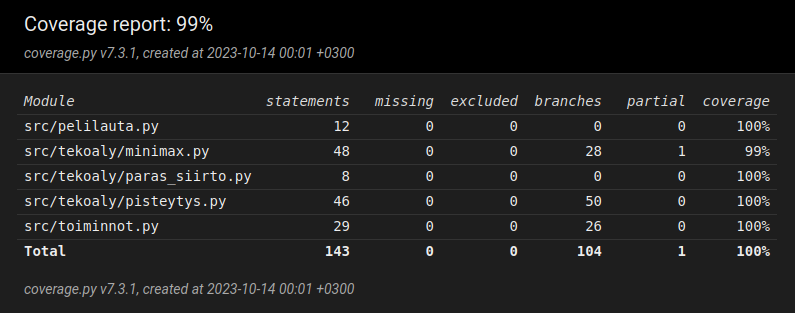

# Testausdokumentti

## Mitä olen testannut?
[TestPeliLauta](/src/tests/pelilauta_test.py)-luokka testaa `PeliLauta`-luokkaa. Testien avulla testataan, että luodaan oikeanlainen matriisi ja että viimeisin siirto tallennetaan oikein.

[TestPisteytys](/src/tests/pisteytys_test.py)-luokka testaa metodeja `pisteytys` ja `tarkista_varma_kolme`. Testataan pisteytystä, tarkemmin sitä, että pisteytys huomaa jos pelilaudalla on kolmen rivi, jonka molemmilla puolilla on vapaa ja sallittu siirto tai kolmen suora pysty, vaaka tai viistosti niin, että toisella puolista on vapaa tila.

[TestToiminnot](/src/tests/toiminnot_test.py)-luokka testaa `Toiminnot`-luokkaa. Testaa, että voitto tarkistetaan oikein, pala tippuu oikealle riville, tallennetaan oikea siirto oikeaan kohtaan, pelilaudalla ei ole tilaa kun se todetaan täydeksi, peli ei hyväksy virheellisiä syötteitä ja jos sarake on täynnä sitä ei voi valita.

[TestParasSiirto](/src/tests/paras_siirto_test.py)-luokka testaa [minimaxin](/src/tekoaly/minimax.py)- ja [paras_siirto](/src/tekoaly/paras_siirto.py) toimintaa. Testaa tilanteita, missä toisella pelaajista on mahdollisuus saada neljän suora. Jos pelaajalla on kolme vierekkäistä tekoäly valitsee blokata neljän suoran. Jos on mahdollista voittaa peli tekoäly valitsee voittavan siirron.

[Käyttöliittymä](/src/kayttoliittyma.py) on testattu käsin.

## Yksikkötestaus ja testikattavuus
Yksikkötestaukseen on käytössä pytest. Testit voi ajaa komennolla:
```
poetry run invoke test
```
Testikattavuuden seuraamista varten käytössä on coverage. Testikattavuus raportti generoituu htmlcov-hakemistoon komennolla:
```
poetry run invoke coverage-report
```

## Testikattavuus
Tämän hetkinen testikattavuus:


## Suorituskykytestaus
Minimaxin suorituskykytestaukseen on käytössä [minimax_suoritus_aika](/src/suorituskykytestit.py)-funktio, jonka avulla mitataan kuinka kauan minimaxilla kestää käydä siirtovaihtoehdot läpi tietyllä syvyydellä.
Suorituskykytestit voi ajaa komennolla:
```
poetry run invoke suorituskyky
```
Esimerkki tämänhetkisistä tuloksista:
```
Syvyys 5 kesto: 0.0416s
Syvyys 6 kesto: 0.0536s
Syvyys 7 kesto: 0.149s
Syvyys 8 kesto: 0.36s
Syvyys 9 kesto: 1.3s
Syvyys 10 kesto: 3.39s
```
