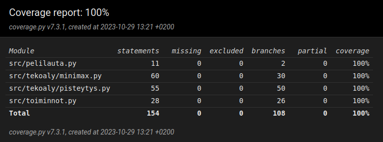

# Testausdokumentti

## Mitä olen testannut?
[TestPeliLauta](/src/tests/pelilauta_test.py)-luokka testaa `PeliLauta`-luokkaa. Testien avulla testataan, että luodaan oikeanlainen matriisi ja että viimeisin siirto tallennetaan oikein.

[TestPisteytys](/src/tests/pisteytys_test.py)-luokka testaa `pisteyta`-funktiota. Testataan pisteytystä, tarkemmin sitä, että pisteytys huomaa jos pelilaudalla on kolmen rivi, jonka molemmilla puolilla on vapaa ja sallittu siirto, tai kolmen suora pysty, vaaka tai viistosti niin, että toisella puolista on vapaa tila. Syötteenä annetaan pelitilannetta kuvaava matriisi ja tuloksia verrataan haluttuun pistemäärään.

[TestToiminnot](/src/tests/toiminnot_test.py)-luokka testaa `Toiminnot`-tiedostosta löytyviä funktioita. Testaa, että voitto tarkistetaan oikein, pala tippuu oikealle riville, tallennetaan oikea siirto oikeaan kohtaan, peli ei hyväksy virheellisiä syötteitä ja jos sarake on täynnä sitä ei voi valita. Voiton tarkistuksen testaamisen syötteenä toimii matriisi, jota muokataan voitto tilanteeseen (pysty, suora ja molemmat viistot) ja tarkistetaan, että `tarkista_voitto` palauttaa True, ja palauttaa False muuten. Oikean rivin tarkistuksen testauksessa syötteenä annetaan matriisi pelin tilanteesta ja pelattava sarake. Testeissä verrataan `vapaa_rivi`-funktion palauttaamaa arvoa syötteenä annettuun oikeean riviin. Virheellisten syötteiden ja sarakkeen valitsemisen testauksessa annetaan `sallittu_siirto`-funktiolle jokin syöte ja tarkistetaan, että se palauttaa tilanteessa oikein.

[TestParasSiirto](/src/tests/paras_siirto_test.py)-luokka testaa [minimaxin ja paras_siirto](/src/tekoaly/minimax.py) toimintaa. Syötteenä aina jokin tietty pelitilanne, josta halutaan valita tietty siirto. Testaa tilanteita, missä toisella pelaajista on mahdollisuus saada neljän suora. Jos pelaajalla on kolme vierekkäistä tekoäly valitsee blokata neljän suoran. Aina, jos on mahdollista voittaa peli, tekoäly valitsee voittavan siirron.

[TestParasSiirtoTekoaly](/src/tests/paras_siirto_test.py)-luokka testaa tekoäly vastaan tekoäly -pelissä käytössä olevaa [paras_siirto_tekoaly_peli](/src/tekoaly/minimax.py)-funktiota. Syöttenä annetaan tilanne, jossa molemmilla on mahdollisuus välittömään voittoon (molemmilla on kolmen pystysuora). Tällaisessa tilanteessa pelaaja valitsee aina oman voiton. Tarkistamme testin avulla, että `paras_siirto_tekoaly_peli` laskee siirrot aina oikealle pelaajalle. Kun on parillinen vuoro funktion pitää tarkistaa pelaajan 1 siirrot ja parittomilla vuoroilla pelaajan 2.

[Käyttöliittymä](/src/kayttoliittyma.py) on testattu käsin.

## Yksikkötestaus ja testikattavuus
Yksikkötestaukseen on käytössä pytest. Testit voi ajaa komennolla:
```
poetry run invoke test
```
Testikattavuuden seuraamista varten käytössä on coverage. Testikattavuus raportti generoituu htmlcov-hakemistoon komennolla:
```
poetry run invoke coverage-report
```

## Testikattavuus
Tämän hetkinen testikattavuus:



## Suorituskykytestaus
Minimaxin suorituskykytestaukseen on käytössä [minimax_suoritus_aika](/src/suorituskykytestit.py)-funktio, jonka avulla mitataan, kuinka kauan minimaxilla kestää käydä siirtovaihtoehdot läpi tietyllä syvyydellä.
Suorituskykytestit voi ajaa komennolla:
```
poetry run invoke suorituskyky
```
Esimerkki tämänhetkisistä tuloksista:
```
Syvyys 4 kesto: 0.0222s
Syvyys 5 kesto: 0.0213s
Syvyys 6 kesto: 0.0572s
Syvyys 7 kesto: 0.128s
Syvyys 8 kesto: 0.429s
Syvyys 9 kesto: 1.09s
Syvyys 10 kesto: 3.43s
```
