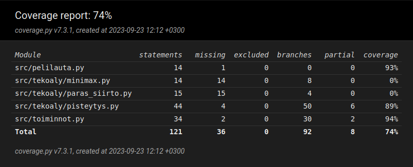

# Testausdokumentti

## Mitä olen testannut?
[TestPeliLauta](/src/tests/pelilauta_test.py)-luokka testaa 'PeliLauta'-luokkaa. Testien avulla testataan, että luodaan oikeanlainen matriisi ja että viimeisin siirto tallennetaan oikein.

[TestPisteytys](/src/tests/pisteytys_test.py)-luokka testaa metodeja 'pisteytys' ja 'tarkista_varma_kolme'. Testataan pisteytystä, tarkemmin sitä, että pisteytys huomaa jos pelilaudalla on kolmen rivi, jonka molemmilla puolilla on vapaa ja sallittu siirto tai kolmen suora pysty, vaaka tai viistosti niin, että toisella puolista on vapaa tila.

[TestToiminnot](/src/tests/toiminnot_test.py)-luokka testaa 'Toiminnot'-luokkaa. Testaa, että voitto tarkistetaan oikein, pala tippuu oikealle riville, tallennetaan oikea siirto oikeaan kohtaan, pelilaudalla ei ole tilaa kun se todetaan täydeksi, peli ei hyväksy virheellisiä syötteitä ja jos sarake on täynnä sitä ei voi valita.

## Yksikkötestaus ja testikattavuus
Yksikkötestaukseen on käytössä pytest. Testit voi ajaa komennolla:
```
poetry run invoke test
```
Testikattavuuden seuraamista varten käytössä on coverage. Testikattavuus raportti generoituu htmlcov-hakemistoon komennolla:
```
poetry run invoke coverage-report
```

## Testikattavuus
Testikattavuutta laskee se, että en ole saanut vielä [minimax](/src/tekoaly/minimax.py)-funktiota ja [paras_siirto](/src/tekoaly/paras_siirto.py) valmiiksi, joten molempien testikattavuus on 0%.


Tämän hetkinen testikattavuus:
