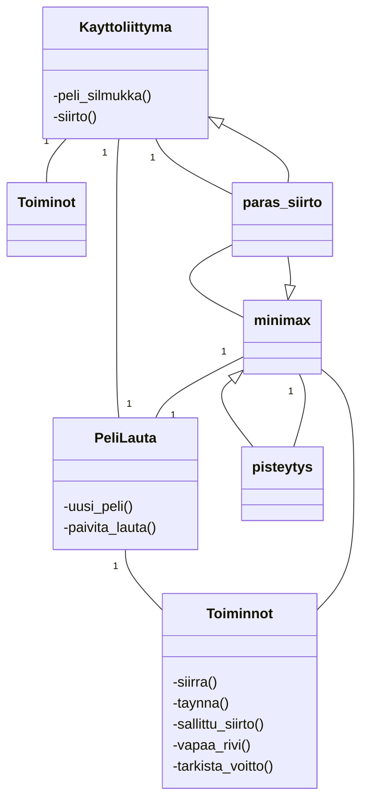

# Toteutusdokumentti

## Yleisrakenne
Ohjelman rakennetta kuvaava luokkakaavio:

## Aika- ja tilavaativuudet

## Työn mahdolliset puutteet ja parannusehdotukset
- Minimax käy vaihtoehdot aina keskeltä ulospäin, jotta voidaan käydä isompi syvyys.
- Pelivalikko, mahdollisuus aloitta alusta/uudelleen

## Lähteet
