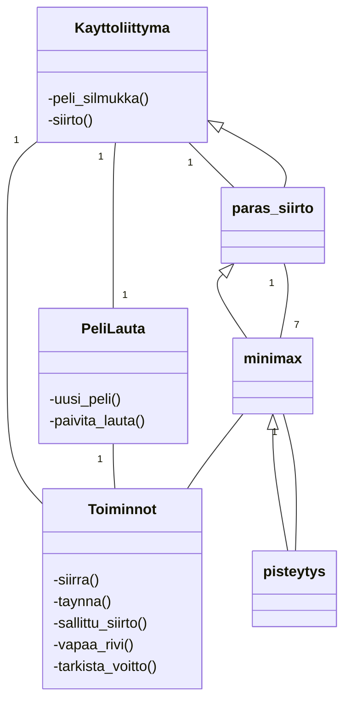

# Toteutusdokumentti

## Yleisrakenne
Ohjelman rakennetta kuvaava luokkakaavio:

## Aika- ja tilavaativuudet

## Työn mahdolliset puutteet ja parannusehdotukset
- Mahdollisuus palata takaisin aloitusnäytölle.
- Seuraavaksi tiputettava pala liikkuu pelilaudan ulkopuollelle.
- Minimax valitsee varman myöhemmän voiton heti pelattavan voiton sijaan joskus.

## Lähteet
