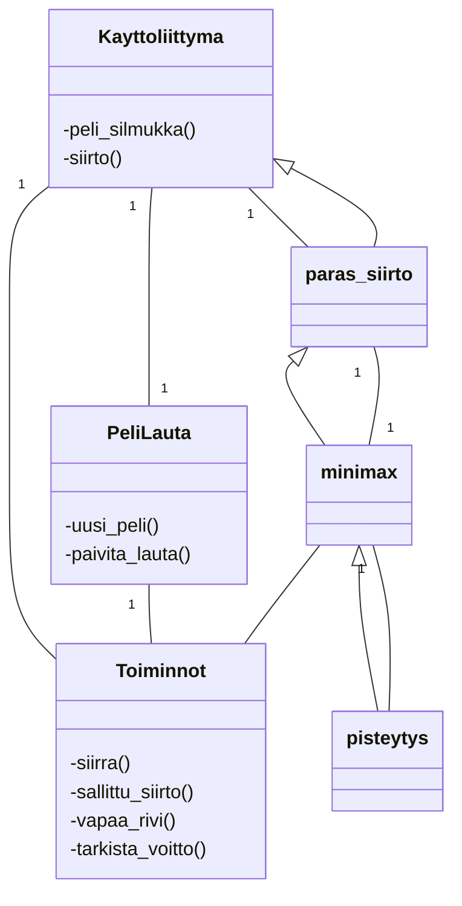

# Toteutusdokumentti

## Yleisrakenne
Ohjelman rakennetta kuvaava luokkakaavio:



Tiedostot johon peli on jaettu:
```
src/

main.py: Käynnistää ohjelman.
ai_vs_ai.py: Käynnistää pelkän tekoäly pelin.
käyttöliittymä.py: Käyttöliittymä-luokka vastaa pelisilmukasta; tapahtumien
tarkastus/pelaajan syötteiden luku ja näytön piirtäminen.

toiminnot.py: Vastaa pelilaudan toiminnoista. Tallentaa siirrot matriisiin,
tarkistaa voiton, tarkistaa onko siirto sallittu, tarkistaa seuraavan vapaan rivin.
pelilauta.py: Vastaa PeliLauta-oliosta.

tekoäly/
minimax.py: Paras_siirto/paras_siirto_tekoaly_peli ja minimax algoritmi. Käytetään
parhaan siirron selvittämiseen.
pisteytys.py: Pelaajan aseman pisteyttämistä varten. Käy pelilaudan läpi ja laskee laudalle arvon.

config.py: Pelin konfiguraatio.
suorituskykytestit.py: Hieman suorituskykytestausta.
tests/: yksikkötestit
```


- Ohjelma on peli, jossa voi pelata Connect Four- peliä tekoälyä vastaan. Tekoälyn siirtojen valitsemiseen käytetään minimax-algoritmia alfa-beta karsinnalla.
- Pelistä on kaksi versiota; ihminen vs tekoäly tai tekoäly vs tekoäly. Molemmat versiot on totetutettu pygamella ja käyttävät pelisilmukkaa, joka vastaa pelin eri vaiheista.
- Pelin version voi valita aloitusnäytön valikossa. Huom. tekoäly vastaan tekoäly pelin voi myös aloittaa erikseen omalla komennolla.
- Versio, jossa tietokone pelaa itseään vastaan on toteutettu niin että [paras_siirto_tekoaly_peli](src/tekoaly/minimax.py):a on muokattu versio `paras_siirto`. Funktiota on muokattu siten, että etsitään aina seuraavaksi pelaavalle pelaajalle paras siirto. Samoin [peli_silmukka_tekoaly_peli](src/kayttoliittyma.py) on muokattu siten, ettei tarkisteta käyttäjän syötteitä siirtoa varten, vaan tehdään siirto vuorotellen keltaiselle ja punaiselle pelaajalle.
- Molemmissa versioissa käyttäjä voi aloittaa pelin alusta. Toisaalta pelkässä tietokoneen pelaamassa pelissä siirrot ovat aina samat, jos syvyyksiä ei muuta.
- Tietokoneiden pelaamassa pelissä on lisätty viivettä siirtojen väliin, jotta peliä on helpompi seurata.


## Heuristiikka:
- Siirrot käydään minimaxilla aina järjestyksessä keskeltä ulospäin, koska parhaat siirrot löytyvät yleensä keskeltä. Siten saadaan puuta karsittua ja laskenta aikaa pienemmäksi.
- Aina kun päästään pelin loppuun (voitto tai tasapeli) tai ollaan käyty haluttu syvyys läpi, arvioidaan pelilaudan tilanne, eli pelaajien asema pelissä.
- Pisteytyksestä vastaa [pisteytys](/src/tekoaly/pisteytys.py)-funktio ja neljän suoran tarkistukseen käytetään [tarkista_voitto](/src/toiminnot.py)-funktiota.
- Molemmat pelaajat yrittävät maksimoida oman voittonsa ja minimoida toisen.
- Ai koittaa saada mahdollisimman suuren heuristisen arvon pelilaudalle.
- Vastaavasti kun lasketaan minimaxilla vastustajan pelattavia siirtoja halutaan saada mahdollisimman pieni arvo.

Taulukko tarkistettavista tapauksista ja niiden pisteytys:
| Tapaus | Pisteet | Kerroin |
| :--- | ---: | :--- |
| Voitto/Häviö | +/-500000 | syvyys |
| Kolmen suora, molemmilla puolilla vapaa pelattava tila | +/-500000 | syvyys |
| Kolme vierekkäin, vapaa toiselta puolelta | 10000/-9000 | kpl |

*Huom. syvyys lasketaan suuremmasta pienempään, eli jos voitto saavutetaan yhden siirron päässä heuristinen arvo on suurempi kuin kolmen siirron päässä


## Aika- ja tilavaativuudet
Minimax algoritmi tarkistaa voiton, joka kerta kun sitä kutsutaan. Voiton tarkistuksen aikavaativuus on O(n), missä n on laudan alkioiden määrä eli rivi*sarakkeet = 42. Minimaxin kutsuman pisteytys-funktion aikavaativuus on samalla tavalla O(n). 
Alfa-beta-karsinnalla minimaxin aikavaativuus on O(b^(d/2)), missä b on vaihtoehtoisten siirtojen määrä, ja d on puun syvyys. Jos karsintaa ei juuri tapahdu, paras valinta on laudan vasemmassa reunassa, ja kaikissa sarakkeissa on tilaa, pahin mahdollinen aikavaativuus on O(b^m). Pahin mahdollinen on kuitenkin erittäin epätodennäköinen, sillä siirrot käydään läpi keskeltä ulospäin, ja sarakkeet täyttyvät, kun siirtoja tulee lisää. Lisäksi pygamen käyttö hidastaa koodin suoritusta jonkin verran. Varsinkin syvyemmissä (9-10) rekursioissa kestää kauemmin, kun minimaxia kutsutaan pelissä. Kun minimaxia kutsutaan pelin ulkopuolella, puun läpikäymiseen syvyydellä 10 menee huomattavasti vähemmän aikaa.

Matriisin tilavaativuus riippu sen alkioiden määrästä (n=42) eli tilavaativuus on O(n). Minimaxin tilavaativuus on O(bm), missä b on valintojen määrä ja m puun syvyys.


## Työn mahdolliset puutteet ja parannusehdotukset
- Mahdollisuus palata takaisin aloitusnäytölle.
- Connect four strategioiden huomiominen.
- Hidas syvyydellä 10 kun pelaa pygamella.
- Mahdollisuus valita vaikeus-taso valikossa.
- Tekoäly peli:
    - Aloitus siirrot olisisivat satunnaisia, muuten saadaan sama peli samalla syvyys valinnoilla.

## Laajat kieilimallit
- Laajoja kielimalleja ei ole käytetty työssä.

## Lähteet
- [Ohjelmistotekniikka materiaali](https://ohjelmistotekniikka-hy.github.io/materiaali)
- [Minimax, Wikipedia](https://en.wikipedia.org/wiki/Minimax#Pseudocode)
- [Alpha-beta pruning, Wikipedia](https://en.wikipedia.org/wiki/Alpha%E2%80%93beta_pruning)
- [Research on Different Heuristics for Minimax Algorithm Insight from Connect-4 Game, Xiyu Kang, Yiqi Wang, Yanrui Hu](https://file.scirp.org/Html/1-9601415_90972.htm#txtF4)
- [Pygame documentation](https://www.pygame.org/docs/)
- [Pytest documentation](https://docs.pytest.org/en/7.4.x/contents.html)
- [Python dokumentaatio](https://docs.python.org/3/library/copy.html)
- [Minimax with Alpha Beta Pruning, John Levine, YouTube](https://youtu.be/zp3VMe0Jpf8?feature=shared)
- [Connect 4 Game Python part 1-2, Keith Galli, YouTube](https://youtu.be/UYgyRArKDEs?feature=shared)
- Vasileios Megalooikonomou, [CIS603-Artificial Intelligence](https://cis.temple.edu/~vasilis/Courses/CIS603/Lectures/l7.html)
