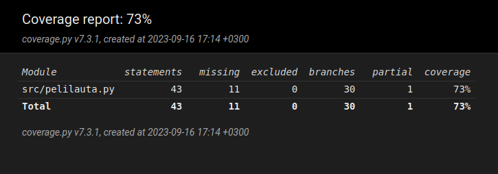

# Viikkoraportti 2

## Mitä olen tehnyt?
Tällä viikolla olen työstänyt pelin alustavaa käyttöjärjestelmää, kirjoittanut koodin kommentteja, aloittanut testaamisen. 

## Miten ohjelma on edistynyt?
Peliä pystyy pelaamaan komentorivillä satunnaisesti pelaavaa tietokonetta vastaan. Pylint, coverage ja invoke otettu myös käyttöön.

## Mitä opin tällä viikolla?
En ole oikeastaan käyttänyt numpya aikasemmin joten olen tutustunut siihen.

## Mikä jäi epäselväksi tai tuottanut vaikeuksia?
Hieman epäselvää on vielä miten numpy toimii, esim. kirjoitin testejä niin oli vaikeuksia antaa valmiiksi täytetty matriisi muuttujalle self.peli.lauta.

## Mitä teen seuraavaksi?
Ehdin jo hieman aloitella tekoälyä, joten jatkan siitä. Myös huomasin jo, että joitain funktioita pitää muokata, jotta ne saa toimimaan tekoälyn kanssa.

## Työhön käytetty aika
| pvm | h | mitä tein |
| :--- | ---: | :--- |
| 11.9 | 2 | pelin toiminta |
| 12.9 | 1 | kommentointi |
| 13.9 | 4 | pelin toiminta ja testit |
| 15.9 | 1 | tekoälyn aloitus |
| yht | 8 tuntia |

## Testikattavuus
Olen ehtinyt kirjoittaamaan vasta muutaman testin ohjelmalle. Tämän hetkinen testikattavuus:

